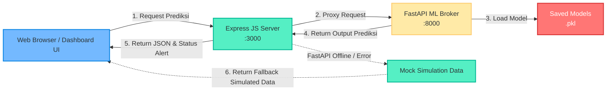

# EWS Monitoring & Gas Prediction System - Kawah Putih 🌋📈

Sistem Machine Learning dan Early Warning System (EWS) terintegrasi untuk memprediksi serta memantau emisi gas vulkanik berbahaya ($SO_2$ dan $H_2S$) di Kawah Putih secara real-time. Sistem ini dibangun dengan pipeline Python ML modular (menggunakan regresi multi-output dengan algoritma berbasis pohon/boosting) dan diintegrasikan dengan aplikasi dashboard monitoring berbasis Node.js & FastAPI.

---

## 📂 Struktur Proyek

Berikut adalah struktur folder dan komponen utama dalam sistem:

```text
proyek-akhir-d3tk-v2/
├── main.py                     # Entry point utama orkestrasi pipeline training
├── requirements.txt            # Dependensi Python ML (scikit-learn, xgboost, lightgbm, catboost, optuna, dll.)
├── data/
│   ├── raw/                    # File CSV mentah per node sensor (node1_data_raw.csv, node2_data_raw.csv)
│   └── processed/              # File dataset akhir gabungan (node_combined_final.csv)
├── src/
│   ├── config.py               # Konfigurasi skenario, fitur, target, dan path data
│   ├── savemodels.py           # Utilitas penyimpanan dan pemuatan model (.pkl)
│   ├── train.py                # Implementasi training loop untuk per-node dan global dengan TimeSeriesSplit CV
│   ├── tuning.py               # Optimasi hyperparameter berbasis Optuna (TPE Bayesian)
│   ├── inference.py            # [BARU] Modul simulasi rolling forecast 1 jam ke depan
│   ├── data/
│   │   └── data_loader.py      # Pemuatan data mentah dan data processed
│   ├── evaluation/
│   │   ├── metrics.py            # Penghitungan metrik regresi (RMSE, MAE, R², MAPE)
│   │   └── feature_importance.py # Analisis Feature Importance bawaan & SHAP
│   ├── features/
│   │   └── preprocess.py       # Preprocessing data, penanganan missing values, & rekayasa fitur
│   └── models/                 # Inisialisasi model dasar (CatBoost, LightGBM, XGBoost, RandomForest)
├── outputs/                    # Folder output metrik CSV, tuning, dan grafik visualisasi
│   ├── tuning/                 # Hasil hyperparameter terbaik dalam bentuk JSON
│   ├── plots/                  # Grafik performa model, feature importance, dan hasil prediksi rolling forecast
│   ├── metrics_scenario_X.csv  # Tabel metrik performa skenario X dalam format CSV
│   └── inference_1h_scenario_X.csv # [BARU] Data hasil simulasi prediksi 1 jam ke depan untuk skenario X
├── saved-models/               # Serialisasi model biner terbaik (.pkl) untuk integrasi
└── app-inference/              # [BARU] Dashboard monitoring & API broker integrasi
    ├── api_service.py          # Broker API berbasis FastAPI (memuat model .pkl & melayani request prediksi)
    ├── server.js               # Node.js Express server (routing API, serve frontend, proxy ke FastAPI)
    ├── package.json            # Manajemen dependensi Express server
    ├── .env                    # Konfigurasi port & environment dashboard
    ├── src/
    │   ├── data/
    │   │   └── mockData.js     # Logika simulasi & fallback jika FastAPI offline
    │   └── routes/
    │       └── api.js          # Router Express untuk proxy request prediksi dan endpoint pendukung
    └── public/                 # Static assets untuk dashboard monitoring UI
        ├── index.html          # Web UI Dashboard EWS interaktif
        ├── css/                # Styling CSS (Vanilla CSS dengan nuansa premium dark-mode)
        └── js/                 # Logic JavaScript frontend (Chart.js, fetching API, state management)
```

---

## ⚙️ Skenario Pengujian (Scenario Config)

Konfigurasi pengujian diatur pada [src/config.py](file:///c:/Users/adith/Desktop/AI/proyek-akhir-d3tk-v2/src/config.py) melalui konstanta `SCENARIO` (nilai 1-4):

| Skenario       | Nama Skenario           | Mode       | Fitur yang Digunakan                                                 |
| :------------- | :---------------------- | :--------- | :------------------------------------------------------------------- |
| **Skenario 1** | Baseline Per-Node       | `per_node` | Fitur dasar meteorologi (`hum_pct`, `temp_c`, `wind_kph`)            |
| **Skenario 2** | Enhanced Per-Node       | `per_node` | Fitur dasar + Fitur temporal + Fitur turunan gas                     |
| **Skenario 3** | Global Model (Baseline) | `global`   | Fitur dasar + Koordinat spasial (`lat`, `lon`, `elev`)               |
| **Skenario 4** | Global Model + Temporal | `global`   | Fitur dasar + Fitur temporal + Fitur turunan gas + Koordinat spasial |

> [!NOTE]
> Secara default, proyek saat ini dikonfigurasi untuk menjalankan **Skenario 4** (Global Model + Temporal) yang memberikan performa dan generalisasi terbaik.

---

## 🔄 Alur Sistem (System Pipeline Flow)

Alur kerja pipeline data dan pemodelan dirancang secara modular dengan diagram proses sebagai berikut:

```mermaid
graph TD
    %% Define Styles
    classDef init fill:#1e1e2f,stroke:#6c5ce7,stroke-width:2px,color:#fff;
    classDef phase1 fill:#2d3436,stroke:#00cec9,stroke-width:2px,color:#fff;
    classDef phase2 fill:#2d3436,stroke:#e17055,stroke-width:2px,color:#fff;
    classDef phase3 fill:#2d3436,stroke:#00b894,stroke-width:2px,color:#fff;
    classDef phase4 fill:#2d3436,stroke:#ffeaa7,stroke-width:2px,color:#2d3436;

    %% Nodes
    A[Mulai main.py]:::init
    B[Muat Konfigurasi Skenario<br>config.py]:::init

    %% Phase 1
    subgraph Fase 1: Preprocessing & Feature Engineering
        C[data_loader.py<br>Load Raw CSV per Node & Merge]:::phase1
        D[preprocess.py<br>Parse & Sort Datetime Kronologis]:::phase1
        E[Ekstraksi Fitur Temporal<br>hour, minute, minute_of_day, cyclical sin/cos]:::phase1
        F[Ekstraksi Fitur Turunan Gas<br>so2_diff, h2s_diff, gas_ratio, Lags t-1 & t-2]:::phase1
        G[Missing Values Handling<br>Forward-fill & Backward-fill per Node]:::phase1
        H[Simpan node_combined_final.csv]:::phase1
    end

    %% Phase 2
    subgraph Fase 2: Tuning & Training
        I{USE_TUNING == True?}:::phase2
        J[tuning.py<br>Optuna TPE Bayesian Tuning<br>TimeSeriesSplit CV 5-folds]:::phase2
        K[Simpan best_params.json]:::phase2
        L[train.py<br>Training 4 Model dengan tuned/default params<br>CatBoost, LightGBM, XGBoost, RF]:::phase2
    end

    %% Phase 3
    subgraph Fase 3: Evaluasi & Feature Importance
        M[metrics.py<br>Hitung RMSE, MAE, R2, MAPE]:::phase3
        N[Cetak Ringkasan Tabel &<br>Simpan outputs/metrics_scenario_X.csv]:::phase3
        O[Simpan Visualisasi Bar Chart Performa]:::phase3
        P[feature_importance.py<br>Built-in & SHAP Analysis per Estimator]:::phase3
    end

    %% Phase 4
    subgraph Fase 4: Rolling Forecast & Model Saving
        Q[inference.py<br>Simulasi Prediksi 1 Jam ke Depan<br>900 Steps @ 4-Detik Interval]:::phase4
        R[Simpan Grafik Prediksi & CSV Hasil]:::phase4
        S[savemodels.py<br>Simpan Model Pemenang ke saved-models/]:::phase4
    end

    T[Selesai]:::init

    %% Relations
    A --> B
    B --> C
    C --> D
    D --> E
    E --> F
    F --> G
    G --> H
    H --> I
    I -- Ya --> J
    J --> K
    K --> L
    I -- Tidak --> L
    L --> M
    M --> N
    N --> O
    O --> P
    P --> Q
    Q --> R
    R --> S
    S --> T
```



### Penjelasan Tahapan Alur Sistem:

#### 1. Inisialisasi & Konfigurasi

Sistem memulai eksekusi melalui [main.py](file:///c:/Users/adith/Desktop/AI/proyek-akhir-d3tk-v2/main.py), yang langsung membaca konfigurasi aktif dari [src/config.py](file:///c:/Users/adith/Desktop/AI/proyek-akhir-d3tk-v2/src/config.py) untuk mengetahui skenario terpilih, mode (`per_node` atau `global`), dan fitur-fitur terkait.

#### 2. Preprocessing & Rekayasa Fitur (Fase 1)

- **Penggabungan Data**: [src/data/data_loader.py](file:///c:/Users/adith/Desktop/AI/proyek-akhir-d3tk-v2/src/data/data_loader.py) memuat file mentah (raw) per node dari `data/raw/` dan menggabungkannya berdasarkan identitas node (`node_id`).
- **Penyusunan Kronologis**: Data diurutkan berdasarkan waktu per node agar tidak mengganggu analisis urutan deret waktu (_time-series_).
- **Fitur Temporal**: Mengekstrak data waktu (`hour`, `minute`, `minute_of_day`) serta melakukan _cyclical encoding_ (sin/cos transformasi jam) untuk membantu algoritma menangkap siklus harian.
- **Fitur Turunan Gas**:
  - Selisih emisi gas antar-waktu (`so2_diff`, `h2s_diff`).
  - Rasio karakteristik gas vulkanik (`gas_ratio_so2_h2s`).
  - Fitur lag waktu (`so2_ugm_lag1`, `so2_ugm_lag2`, `h2s_ugm_lag1`, `h2s_ugm_lag2`) untuk menangkap autokorelasi.
- **Imputasi Missing Values**: Mengisi data sensor kosong menggunakan metode _forward-fill_ (`ffill`) lalu _backward-fill_ (`bfill`) per node agar tidak terjadi kebocoran data antar-node.
- Dataset akhir disimpan ke `data/processed/node_combined_final.csv`.

#### 3. Optimasi Hyperparameter (Fase 2a)

Jika bendera `USE_TUNING` aktif pada [main.py](file:///c:/Users/adith/Desktop/AI/proyek-akhir-d3tk-v2/main.py):

- [src/tuning.py](file:///c:/Users/adith/Desktop/AI/proyek-akhir-d3tk-v2/src/tuning.py) akan melakukan pencarian hyperparameter optimal menggunakan **Optuna** dengan sampler _Tree-structured Parzen Estimator (TPE)_.
- Validasi silang menggunakan **TimeSeriesSplit (5 folds)** diterapkan untuk mencegah kebocoran informasi masa depan (_look-ahead bias/data leakage_).
- Hasil hyperparameter terbaik disimpan sebagai file JSON di direktori `outputs/tuning/`.

#### 4. Pelatihan Model (Fase 2b)

- [src/train.py](file:///c:/Users/adith/Desktop/AI/proyek-akhir-d3tk-v2/src/train.py) melatih 4 jenis model regresi: **CatBoost**, **LightGBM**, **XGBoost**, dan **Random Forest**.
- Karena target prediksi bersifat multi-output yakni `so2_ugm` dan `h2s_ugm` secara simultan, model dibungkus dalam `MultiOutputRegressor` dari scikit-learn.
- Pelatihan disesuaikan dengan mode skenario:
  - _Mode Per-Node_: Melatih model independen secara spesifik untuk masing-masing sensor node.
  - _Mode Global_: Melatih satu model terpadu pada gabungan data semua node dengan menyertakan koordinat spasial (`lat`, `lon`, `elev`).

#### 5. Evaluasi & Feature Importance (Fase 3)

- [src/evaluation/metrics.py](file:///c:/Users/adith/Desktop/AI/proyek-akhir-d3tk-v2/src/evaluation/metrics.py) mengevaluasi model pada _hold-out test set_ (split kronologis terakhir) menggunakan metrik: **RMSE, MAE, R²**, dan **MAPE**.
- Metrik performa disimpan sebagai file CSV di `outputs/metrics_scenario_X.csv` dan plot grafis di `outputs/plots/metrics_barchart_scenario_X.png`.
- [src/evaluation/feature_importance.py](file:///c:/Users/adith/Desktop/AI/proyek-akhir-d3tk-v2/src/evaluation/feature_importance.py) menganalisis kontribusi fitur baik secara bawaan (built-in importance) maupun global melalui **SHAP Analysis (TreeExplainer)** dengan mengekstrak estimator internal dari `MultiOutputRegressor`.

#### 6. Rolling Forecast & Penyimpanan Model (Fase 4)

- [src/inference.py](file:///c:/Users/adith/Desktop/AI/proyek-akhir-d3tk-v2/src/inference.py) melakukan simulasi pergerakan prediksi gas 1 jam ke depan (3600 detik = 900 steps dengan interval data 4 detik) secara bertahap menggunakan pendekatan **rolling forecast**:
  1.  Membaca state sensor riil terakhir dari dataset.
  2.  Men-generate rentang waktu baru ke depan.
  3.  Menggunakan output prediksi $SO_2$ dan $H_2S$ pada langkah $t$ sebagai input lag fitur (`so2_ugm_lag1`, `h2s_ugm_lag1`, dll.) untuk langkah $t+1$.
  4.  Menjaga fitur meteorologi (cuaca) tetap konstan berdasarkan kondisi riil terakhir yang teramati.
- Data hasil peramalan disimpan ke `outputs/inference_1h_scenario_X.csv` dan divisualisasikan dalam bentuk grafik deret waktu di `outputs/plots/inference_1h_nodeY_scenario_X.png`.
- Seluruh model disimpan menggunakan pustaka `joblib` ke dalam folder `saved-models/` agar siap digunakan untuk tahap deployment/web-inference.

---

## 🔌 Integrasi & Arsitektur Dashboard Web (EWS Web Dashboard)

Untuk implementasi real-time monitoring, sistem ML diintegrasikan dengan aplikasi web early warning dashboard. Berikut adalah skema komunikasi data antar komponen:



### Mekanisme Kerja Integrasi:

1.  **FastAPI ML Broker (`app-inference/api_service.py`)**:
    - FastAPI bertindak sebagai gerbang backend Python yang memuat model-model dari folder `saved-models/` ke dalam memori secara dinamis dan di-cache menggunakan `lru_cache`.
    - Menyediakan endpoint `POST /predict` yang menerima payload data cuaca, parameter waktu, data lag, dan identitas node.
    - FastAPI memetakan data masukan sesuai dengan skenario aktif (1-4) sebelum melemparkannya ke model yang sesuai, lalu mengembalikan prediksi kadar $SO_2$ dan $H_2S$.
2.  **Express JS Server (`app-inference/server.js`)**:
    - Node.js bertindak sebagai server utama aplikasi web (berjalan pada port `3000`).
    - Menyediakan API routing (`/api/predict`, `/api/history`, dll.) dan meng-host file statis web frontend.
    - Saat menerima permintaan `/api/predict`, Express akan mem-proxy panggilan tersebut ke FastAPI (`http://127.0.0.1:8000/predict`).
3.  **Mekanisme Fallback Aman**:
    - Apabila FastAPI service sedang offline atau mengalami kegagalan, Express server akan menangkap _error_ tersebut dan **secara otomatis melakukan fallback ke data simulasi / mock data** (`app-inference/src/data/mockData.js`).
    - Di dashboard web, model prediksi akan diberi label `(S)` (misalnya `RandomForest (S)`) untuk memberikan transparansi kepada operator bahwa data yang ditampilkan adalah data simulasi cadangan.
4.  **Dashboard Frontend (`app-inference/public/index.html`)**:
    - Menyuguhkan visualisasi grafik monitoring interaktif, visualisasi status alert (**AMAN** - Hijau, **WASPADA** - Kuning, **BAHAYA** - Merah) berdasarkan ambang batas kadar gas, panel kendali skenario, model, dan input data cuaca interaktif.

---

## 📊 Hasil Evaluasi Terbaru (Skenario 4)

Berikut adalah metrik performa model global yang dievaluasi secara menyeluruh pada data pengujian Skenario 4:

| Model            | RMSE 📉    | MAE 📉     | R² 📈      | MAPE (%) 📉 |
| :--------------- | :--------- | :--------- | :--------- | :---------- |
| **XGBoost**      | **4.6800** | 1.1614     | **0.9977** | **2.13%**   |
| **LightGBM**     | 5.4070     | **1.1211** | 0.9968     | 2.51%       |
| **CatBoost**     | 8.2862     | 4.6400     | 0.9941     | 26.48%      |
| **RandomForest** | 9.3872     | 3.8392     | 0.9914     | 6.71%       |

> [!TIP]
> Model **XGBoost** dan **LightGBM** memberikan akurasi prediksi tertinggi dengan nilai $R^2$ mencapai **> 0.99** dan persentase kesalahan (MAPE) yang sangat kecil (~2%).

---

## 🚀 Cara Menjalankan Sistem

### 📦 Prasyarat (Requirements)

- **Python**: versi 3.10 ke atas
- **Node.js**: versi 18 ke atas (dengan NPM)
- **Sistem Operasi**: Windows (disesuaikan dengan lingkungan `.venv-win`)

---

### Langkah 1: Persiapan Virtual Environment & Python Dependensi

1.  Buka terminal PowerShell Anda dan arahkan ke root direktori proyek.
2.  Aktifkan lingkungan virtual Python:
    ```powershell
    .venv-win\Scripts\activate
    ```
3.  Pastikan semua dependensi terinstal (termasuk pustaka FastAPI & Uvicorn untuk hosting API):
    ```powershell
    pip install -r requirements.txt fastapi uvicorn
    ```

---

### Langkah 2: Menjalankan Training Pipeline ML

1.  Sesuaikan konfigurasi skenario aktif di [src/config.py](file:///c:/Users/adith/Desktop/AI/proyek-akhir-d3tk-v2/src/config.py) (contoh: `SCENARIO = 4`).
2.  Jalankan pipeline untuk preprocessing, tuning, training, evaluasi, rolling forecast, dan penyimpanan model:
    ```powershell
    python main.py
    ```
3.  Pastikan file model baru telah tersimpan dengan benar di folder `saved-models/`.

---

### Langkah 3: Menjalankan FastAPI Broker Service

Layanan ini harus berjalan agar Express JS dashboard dapat mengirimkan data sensor dan mendapatkan hasil prediksi nyata dari model machine learning.

1.  Buka tab terminal baru (tetap dalam kondisi virtual environment aktif).
2.  Arahkan ke folder `app-inference/`:
    ```powershell
    cd app-inference
    ```
3.  Jalankan server FastAPI:
    ```powershell
    python -m uvicorn api_service:app --host 127.0.0.1 --port 8000 --reload
    ```
    _FastAPI akan aktif di `http://127.0.0.1:8000`._

---

### Langkah 4: Menjalankan Express JS & Dashboard Frontend

1.  Buka tab terminal baru lainnya.
2.  Arahkan ke folder `app-inference/`:
    ```powershell
    cd app-inference
    ```
3.  Instal dependensi Node.js (hanya perlu dijalankan sekali):
    ```powershell
    npm install
    ```
4.  Jalankan server Express:
    - Untuk mode produksi/standar:
      ```powershell
      npm start
      ```
    - Untuk mode pengembangan (dengan auto-reload nodemon):
      ```powershell
      npm run dev
      ```
5.  Buka browser Anda dan akses dashboard EWS di alamat: **`http://localhost:3000`**.
