# Kawah Putih Gas Prediction System 🌋📈

Sistem Machine Learning untuk memprediksi emisi gas vulkanik ($SO_2$ dan $H_2S$) di Kawah Putih menggunakan data sensor meteorologi dari beberapa node sensor. Pipeline ini mendukung pelatihan model lokal (per-node) maupun model terpadu (global) dengan optimasi hyperparameter berbasis Bayesian.

---

## 📂 Struktur Proyek

Berikut adalah struktur folder dan komponen utama dalam sistem:

```text
proyek-akhir-d3tk-v2/
├── main.py                     # Entry point utama orkestrasi pipeline
├── requirements.txt            # Dependensi Python (scikit-learn, xgboost, lightgbm, catboost, optuna, dll.)
├── data/
│   ├── raw/                    # File CSV mentah per node (node1_data_raw.csv, node2_data_raw.csv)
│   └── processed/              # File dataset akhir gabungan (node_combined_final.csv)
├── src/
│   ├── config.py               # Konfigurasi skenario, fitur, target, dan path data
│   ├── savemodels.py           # Utilitas penyimpanan dan pemuatan model (.pkl)
│   ├── train.py                # Implementasi training loop untuk per-node dan global
│   ├── tuning.py               # Optimasi hyperparameter menggunakan Optuna (TPE Bayesian)
│   ├── data/
│   │   └── data_loader.py      # Pemuatan data mentah dan data processed
│   ├── evaluation/
│   │   ├── metrics.py            # Penghitungan metrik regresi (RMSE, MAE, R², MAPE)
│   │   └── feature_importance.py # Analisis Feature Importance bawaan & SHAP
│   ├── features/
│   │   └── preprocess.py       # Preprocessing data, penanganan missing values, & rekayasa fitur
│   └── models/                 # Inisialisasi model dasar (CatBoost, LightGBM, XGBoost, RandomForest)
├── outputs/                    # Folder output metrik CSV dan chart evaluasi
│   ├── tuning/                 # File JSON parameter terbaik hasil Optuna
│   └── plots/                  # Visualisasi chart perbandingan performa model
└── saved-models/               # Serialisasi model terpilih (.pkl)
```

---

## ⚙️ Skenario Pengujian (Scenario Config)

Konfigurasi pengujian diatur pada [src/config.py](file:///c:/Users/adith/Desktop/AI/proyek-akhir-d3tk-v2/src/config.py) melalui konstanta `SCENARIO` (nilai 1-4):

| Skenario | Nama Skenario | Mode | Fitur yang Digunakan |
| :--- | :--- | :--- | :--- |
| **Skenario 1** | Baseline Per-Node | `per_node` | Fitur dasar meteorologi (`hum_pct`, `temp_c`, `wind_kph`) |
| **Skenario 2** | Enhanced Per-Node | `per_node` | Fitur dasar + Fitur temporal + Fitur turunan gas |
| **Skenario 3** | Global Model (Baseline) | `global` | Fitur dasar + Koordinat spasial (`lat`, `lon`, `elev`) |
| **Skenario 4** | Global Model + Temporal | `global` | Fitur dasar + Fitur temporal + Fitur turunan gas + Koordinat spasial |

> [!NOTE]
> Secara default, proyek saat ini dikonfigurasi untuk menjalankan **Skenario 4** (Global Model + Temporal).

---

## 🔄 Alur Sistem (System Pipeline Flow)

Alur kerja pipeline data dan pemodelan dirancang secara modular dengan diagram proses sebagai berikut:

```mermaid
graph TD
    %% Define Styles
    classDef init fill:#1e1e2f,stroke:#6c5ce7,stroke-width:2px,color:#fff;
    classDef phase1 fill:#2d3436,stroke:#00cec9,stroke-width:2px,color:#fff;
    classDef phase2 fill:#2d3436,stroke:#e17055,stroke-width:2px,color:#fff;
    classDef phase3 fill:#2d3436,stroke:#00b894,stroke-width:2px,color:#fff;

    %% Nodes
    A[Mulai main.py]:::init
    B[Muat Konfigurasi Skenario<br>config.py]:::init
    
    %% Phase 1
    subgraph Fase 1: Preprocessing & Feature Engineering
        C[data_loader.py<br>Load Raw CSV per Node & Merge]:::phase1
        D[preprocess.py<br>Parse & Sort Datetime Kronologis]:::phase1
        E[Ekstraksi Fitur Temporal<br>hour, minute, minute_of_day, cyclical sin/cos]:::phase1
        F[Ekstraksi Fitur Turunan Gas<br>so2_diff, h2s_diff, gas_ratio, Lags t-1 & t-2]:::phase1
        G[Missing Values Handling<br>Forward-fill & Backward-fill per Node]:::phase1
        H[Simpan node_combined_final.csv]:::phase1
    end
    
    %% Phase 2
    subgraph Fase 2: Tuning & Training
        I{USE_TUNING == True?}:::phase2
        J[tuning.py<br>Optuna TPE Bayesian Tuning<br>TimeSeriesSplit CV 5-folds]:::phase2
        K[Simpan best_params.json]:::phase2
        L[train.py<br>Training 4 Model dengan tuned/default params<br>CatBoost, LightGBM, XGBoost, RF]:::phase2
    end
    
    %% Phase 3
    subgraph Fase 3: Evaluasi & Penyimpanan
        M[metrics.py<br>Hitung RMSE, MAE, R2, MAPE]:::phase3
        N[Cetak Ringkasan Tabel &<br>Simpan outputs/metrics_scenario_X.csv]:::phase3
        O[Simpan Visualisasi Bar Chart Performa]:::phase3
        P[savemodels.py<br>Simpan Model Terbaik ke .pkl]:::phase3
    end
    
    Q[Selesai]:::init

    %% Relations
    A --> B
    B --> C
    C --> D
    D --> E
    E --> F
    F --> G
    G --> H
    H --> I
    I -- Ya --> J
    J --> K
    K --> L
    I -- Tidak --> L
    L --> M
    M --> N
    N --> O
    O --> P
    P --> Q
```



### Penjelasan Tahapan Alur Sistem:

#### 1. Inisialisasi & Konfigurasi
Sistem memulai eksekusi melalui [main.py](file:///c:/Users/adith/Desktop/AI/proyek-akhir-d3tk-v2/main.py), yang langsung membaca konfigurasi dari [src/config.py](file:///c:/Users/adith/Desktop/AI/proyek-akhir-d3tk-v2/src/config.py) untuk mengetahui skenario mana yang aktif dan fitur apa saja yang perlu dilibatkan.

#### 2. Preprocessing & Rekayasa Fitur (Fase 1)
*   **Penggabungan Data**: [src/data/data_loader.py](file:///c:/Users/adith/Desktop/AI/proyek-akhir-d3tk-v2/src/data/data_loader.py) memuat seluruh file data mentah dari `data/raw/` dan menggabungkannya berdasarkan identitas node (`node_id`).
*   **Penyusunan Kronologis**: Data diurutkan berdasarkan waktu per node untuk memastikan validitas analisis deret waktu.
*   **Fitur Temporal**: Mengekstrak data waktu (`hour`, `minute`, `minute_of_day`) serta melakukan *cyclical encoding* (sin/cos transformasi jam) untuk membantu algoritma menangkap siklus harian.
*   **Fitur Turunan Gas**: 
    *   Selisih emisi gas antar-waktu (`so2_diff`, `h2s_diff`).
    *   Rasio karakteristik gas vulkanik (`gas_ratio_so2_h2s`).
    *   Fitur lag waktu (`so2_ugm_lag1`, `so2_ugm_lag2`, `h2s_ugm_lag1`, `h2s_ugm_lag2`) untuk menangkap autokorelasi.
*   **Imputasi Missing Values**: Mengisi data sensor kosong menggunakan metode *forward-fill* (`ffill`) lalu *backward-fill* (`bfill`) per node agar tidak terjadi kebocoran data antar-node.
*   Dataset akhir disimpan ke `data/processed/node_combined_final.csv`.

#### 3. Optimasi Hyperparameter (Fase 2a)
Jika bendera `USE_TUNING` aktif pada [main.py](file:///c:/Users/adith/Desktop/AI/proyek-akhir-d3tk-v2/main.py):
*   [src/tuning.py](file:///c:/Users/adith/Desktop/AI/proyek-akhir-d3tk-v2/src/tuning.py) akan melakukan pencarian hyperparameter optimal menggunakan **Optuna** dengan sampler *Tree-structured Parzen Estimator (TPE)* yang efisien.
*   Validasi silang menggunakan **TimeSeriesSplit (5 folds)** diterapkan untuk mencegah kebocoran informasi masa depan (*look-ahead bias/data leakage*).
*   Hasil hyperparameter terbaik disimpan dalam bentuk file JSON di direktori `outputs/tuning/`.

#### 4. Pelatihan Model (Fase 2b)
*   [src/train.py](file:///c:/Users/adith/Desktop/AI/proyek-akhir-d3tk-v2/src/train.py) melatih 4 jenis model regresi:
    1.  **CatBoost Regressor**
    2.  **LightGBM Regressor**
    3.  **XGBoost Regressor**
    4.  **Random Forest Regressor**
*   Target prediksi bersifat multi-output yakni `so2_ugm` dan `h2s_ugm`, sehingga dibungkus dalam `MultiOutputRegressor` dari scikit-learn.
*   Pelatihan disesuaikan dengan mode skenario:
    *   *Mode Per-Node*: Melatih model independen secara spesifik untuk masing-masing sensor node.
    *   *Mode Global*: Melatih satu model terpadu pada gabungan data semua node dengan menyertakan koordinat spasial (`lat`, `lon`, `elev`).

#### 5. Evaluasi & Output (Fase 3)
*   [src/evaluation/metrics.py](file:///c:/Users/adith/Desktop/AI/proyek-akhir-d3tk-v2/src/evaluation/metrics.py) mengevaluasi model pada *hold-out test set* (split kronologis terakhir) menggunakan metrik: **RMSE, MAE, R²**, dan **MAPE**.
*   Metrik performa dicetak ke console, lalu disimpan sebagai file CSV di `outputs/metrics_scenario_X.csv`.
*   Sistem menggambar grafik batang perbandingan performa RMSE dan MAE antar-model di `outputs/plots/metrics_barchart_scenario_X.png`.
*   Seluruh model yang telah dilatih disimpan menggunakan pustaka `joblib` ke dalam folder `saved-models/` agar siap digunakan untuk tahap deployment/inferensi.

---

## 📊 Hasil Evaluasi Terbaru (Skenario 4)

Berikut adalah metrik performa model global yang dievaluasi secara menyeluruh pada data pengujian Skenario 4:

| Model | RMSE 📉 | MAE 📉 | R² 📈 | MAPE (%) 📉 |
| :--- | :--- | :--- | :--- | :--- |
| **XGBoost** | **4.6800** | 1.1614 | **0.9977** | **2.13%** |
| **LightGBM** | 5.4070 | **1.1211** | 0.9968 | 2.51% |
| **CatBoost** | 8.2862 | 4.6400 | 0.9941 | 26.48% |
| **RandomForest** | 9.3872 | 3.8392 | 0.9914 | 6.71% |

> [!TIP]
> Model **XGBoost** dan **LightGBM** memberikan akurasi prediksi tertinggi dengan nilai $R^2$ mencapai **> 0.99** dan persentase kesalahan (MAPE) yang sangat kecil (~2%).

---

## 🚀 Cara Menjalankan Pipeline

1.  **Aktifkan Lingkungan Virtual**:
    Pastikan Anda menggunakan venv khusus Windows yang telah dikonfigurasi:
    ```powershell
    .venv-win\Scripts\activate
    ```
2.  **Pilih Skenario**:
    Buka file [src/config.py](file:///c:/Users/adith/Desktop/AI/proyek-akhir-d3tk-v2/src/config.py) dan sesuaikan nilai variabel `SCENARIO` (misalnya `SCENARIO = 4`).
3.  **Jalankan Pipeline**:
    Eksekusi file entrypoint:
    ```powershell
    python main.py
    ```
4.  **Lihat Hasil**:
    Hasil evaluasi berupa tabel metrik dapat dicek di `outputs/metrics_scenario_X.csv` dan plot grafis di `outputs/plots/`. Model biner tersimpan di folder `saved-models/`.
